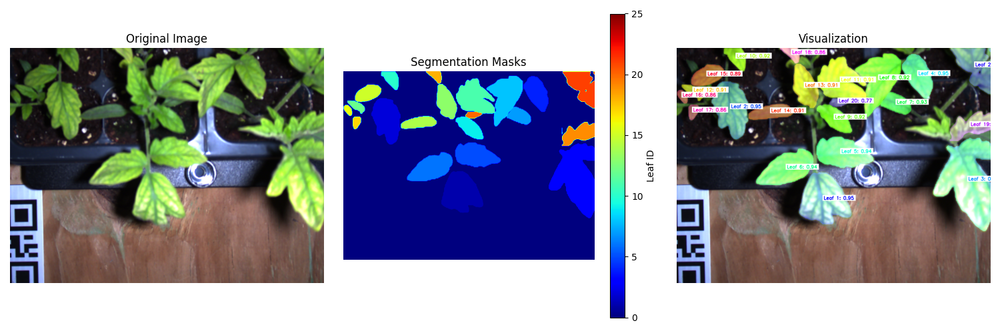

# YOLOv8 Leaf Segmentation (REX)

## Overview
A computer vision system for precise leaf instance segmentation, specifically designed for the REX gantry robot. The system utilizes a custom-trained YOLOv8 model to provide accurate leaf detection and segmentation, enabling automated robotic grasping and manipulation tasks in agricultural settings.

## Features
- Real-time leaf instance segmentation
- High-confidence detection (>0.90 average confidence)
- Multi-leaf tracking with unique instance IDs
- Precise contour generation for each leaf
- Automated statistics generation (area, perimeter)
- Integration with robotic grasping systems
- Support for stereo camera inputs

## System Requirements
- CUDA-capable GPU (tested on NVIDIA GPUs)
- Python 3.8+
- PyTorch 2.0+

## Installation

```bash
# Clone the repository
git clone https://github.com/yourusername/YoloV8Seg-REX.git
cd YoloV8Seg-REX

# Create conda environment
conda env create -f environment.yml
conda activate yolo-v8

# Download pre-trained weights
wget https://drive.google.com/file/d/1IfbEu46vCMeQ-PtjwJ3RlUAobK5jPzQu/view?usp=drive_link -O weights/large_best.pt
```

## Quick Start

```python
from src.inference.segmentation import LeafSegmentation

# Initialize segmenter with pre-trained weights
segmenter = LeafSegmentation(model_path="weights/large_best.pt")

# Process image with visualization
results = segmenter.segment_image(
    "path/to/image.jpg",
    visualize=True,
    output_json=True
)

# Access detailed results
masks = results['masks']           # Individual leaf masks
scores = results['scores']         # Confidence scores
stats = results['leaf_stats']      # Area, perimeter, etc.
viz = results['visualization']     # Visualization image
```

## Technical Implementation

### System Overview
This project implements instance segmentation for plant leaves using YOLOv8's segmentation capabilities, specifically adapted for robotic gantry systems. The model has been optimized for overhead leaf detection in agricultural environments.

### Data Collection & Preparation
- **Hardware Setup**:
  - Stereo camera system mounted on REX gantry robot
  - Top-down view of plant beds
  - Image Resolution: 1440×1080 pixels

- **Dataset Details**:
  - 847 overhead plant images
  - Split: 90% training (762 images), 10% validation (85 images)
  - Single class ('leaf') detection
  - Various lighting conditions and leaf orientations

### Model Configuration
```yaml
# Dataset Configuration
path: ../datasets/leaf  
train: images/train
val: images/val
names:
  0: leaf

# Training Parameters
epochs: 500
imgsz: 1440
batch_size: 4
overlap_mask: True
patience: 100
```

### Performance Metrics
- Processing Speed: ~60ms per frame
  - Main inference: 52ms
  - Mask generation: 8ms
- Average Confidence: >0.90
- Real-time Capable: 16+ FPS

## Example Results

*Left: Original image, Center: Instance segmentation masks, Right: Visualization with confidence scores*

## Applications
- Automated leaf grasping in robotic systems
- Plant monitoring and phenotyping
- Agricultural automation
- Research applications

## Pre-trained Weights
Download the trained model weights from [Google Drive](https://drive.google.com/file/d/1IfbEu46vCMeQ-PtjwJ3RlUAobK5jPzQu/view?usp=drive_link)

## Contributing
Contributions are welcome! Please feel free to submit a Pull Request.

## License
[MIT License](LICENSE)

## Citation
If you use this work in your research, please cite:
```bibtex
@software{yolov8_leaf_segmentation_rex,
    title={YOLOv8 Leaf Segmentation for Robotic Applications},
    author={Your Name},
    year={2024},
    url={https://github.com/yourusername/YoloV8Seg-REX}
}
```